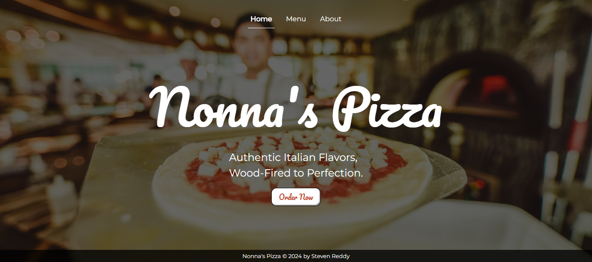
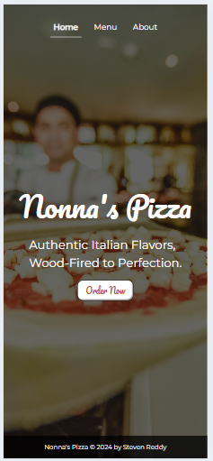
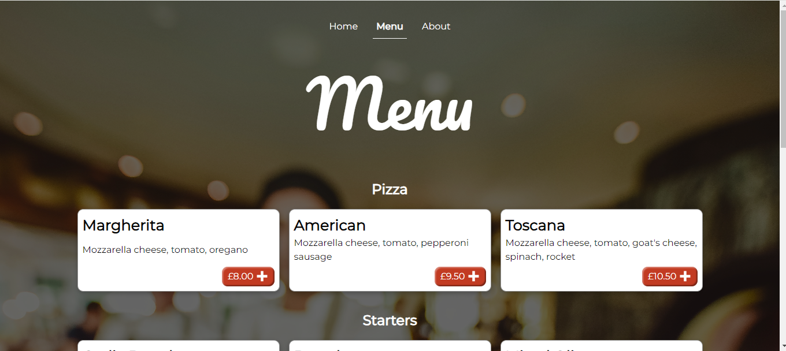
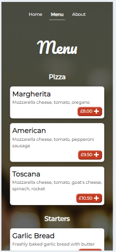
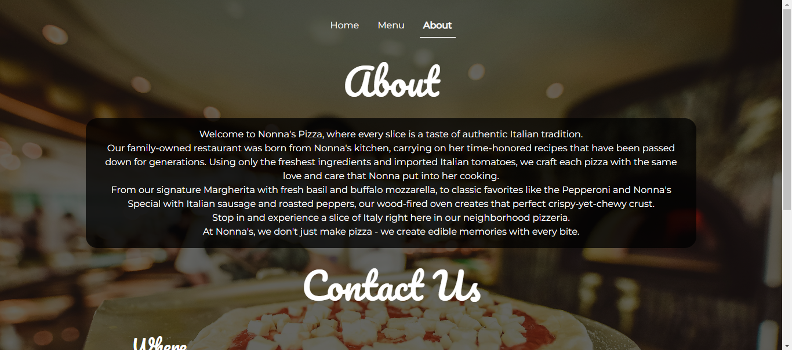
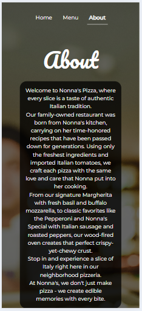

Your project description is well-written and informative. I'll make a few minor grammatical and stylistic adjustments while maintaining the overall tone and structure:

# The Odin Project - Restaurant Page

## Objective

This project utilized the new knowledge of Webpack and continued with DOM manipulation to create a restaurant website, using an HTML template and JavaScript to add and remove elements from the document. Webpack was then used to run and build the website, deploying after bundling and compiling the code. I used this project to create a more interchangeable website, focusing on a mobile-first mindset and ensuring it's easily edited and updated.

## Model 
### Landing Page
|  Desktop | Mobile   | 
|----------|----------|
| ||

Following the given criteria, I used a class system to display and hide pages using DOM manipulation. I made sure to empty the HTML content template on each change and kept track of which page is active to display this on the nav bar at the top of the page. 

I used `@font-face` to import different fonts and apply them to various elements. Additionally, I applied a CSS reset and `:root` variables to keep the CSS tidy and organized. 

With the new knowledge about Webpack and modules, I could easily separate each page into different modules and use `export default` to import them into the main `index.js` page. This made the code much easier to read and maintain. 

### Menu

|  Desktop | Mobile   | 
|----------|----------|
| ||

To avoid repeating code in this section for each menu item, I used both arrays and objects to separate the data. Then, I used a nested for loop to iterate through the menu items. By applying the same class name, I could easily create each menu item as a card and add CSS properties for all elements without repetition.

To differentiate between each type of menu item, I ensured the first item in each inner array was the header. Using grid, it was easy to add a `className` to them and use `grid: -1/1` to span across the whole screen and add any other necessary styling. The use of `auto-fill` was great for adding each card with ease and keeping it responsive to any screen size. 

### About

|  Desktop | Mobile   |
|----------|----------|
| ||

I used the same process of `export default` and import into the main `index.js` file for this page as well. One difference here was adding the map, which required creating an `iframe` element and adding the embedded map data to each property for it to display on the page.

`@media` queries were great for displaying the contact section as intended, using a grid layout for desktop and stacking elements as the screen width decreased below 700px. This was also applied to the landing page `h1` to make it responsive to the user's screen size. 

Lastly, I was able to add the footer in the same way as all the other pages, exporting and importing it separately to keep the code organized. 

## Problems encountered
- Separating Webpack into production and development configurations
- Adding an embedded map from Google
- Deploying to `gh-pages`
- Using `@media` queries
- Exporting and importing modules

## New skills
- Adding module rules and separating production and development configurations
- Manipulating `iframe` properties and adding them to the document
- Using `subtree` and adding custom scripts to the `package.json`
- Creating a mobile-first website
- Successfully separating code and importing/exporting across the document

## Languages
- HTML
- CSS
- JavaScript
- Webpack